# Task Report - Zimo Xu, 2023.11.11

For all the tasks have source code, there is a mark "</>" behind sub-header. You can check them from the souce code zip if you are interested in.

## Basic tasks

### I. B1 </>

In Task B1, I use a convolutional encoder-decoder to learn the pattern of the data in MNIST with noise, and denosing the pictures.

#### 1. Work Process

To achieve this, what I have done are as follows:

1. Download MNIST and transfer them into correct format for the following training.
2. Define my encoder-decoder, there is architecture of the network below:

   > ConvAutoencoder(
   > (encoder): Sequential(
   > (0): Conv2d(1, 16, kernel_size=(3, 3), stride=(2, 2), padding=(1, 1))
   > (1): ReLU()
   > (2): BatchNorm2d(16, eps=1e-05, momentum=0.1, affine=True, track_running_stats=True)
   > (3): Conv2d(16, 32, kernel_size=(3, 3), stride=(2, 2), padding=(1, 1))
   > (4): ReLU()
   > (5): BatchNorm2d(32, eps=1e-05, momentum=0.1, affine=True, track_running_stats=True)
   > )
   > (decoder): Sequential(
   > (0): ConvTranspose2d(32, 16, kernel_size=(3, 3), stride=(2, 2), padding=(1, 1), output_padding=(1, 1))
   > (1): ReLU()
   > (2): BatchNorm2d(16, eps=1e-05, momentum=0.1, affine=True, track_running_stats=True)
   > (3): ConvTranspose2d(16, 1, kernel_size=(3, 3), stride=(2, 2), padding=(1, 1), output_padding=(1, 1))
   > (4): Sigmoid()
   > )# Task Report - Zimo Xu, 2023.11.11
   >

For all the tasks have source code, there is a mark "</>" behind sub-header. You can check them from the souce code zip if you are interested in.

## Basic tasks

### I. B1 </>

In Task B1, I use a convolutional encoder-decoder to learn the pattern of the data in MNIST with noise, and denosing the pictures.

#### 1. Work Process

To achieve this, what I have done are as follows:

1. Download MNIST and transfer them into correct format for the following training.
2. Define my encoder-decoder, there is architecture of the network below:

   > ConvAutoencoder(
   > (encoder): Sequential(
   > (0): Conv2d(1, 16, kernel_size=(3, 3), stride=(2, 2), padding=(1, 1))
   > (1): ReLU()
   > (2): BatchNorm2d(16, eps=1e-05, momentum=0.1, affine=True, track_running_stats=True)
   > (3): Conv2d(16, 32, kernel_size=(3, 3), stride=(2, 2), padding=(1, 1))
   > (4): ReLU()
   > (5): BatchNorm2d(32, eps=1e-05, momentum=0.1, affine=True, track_running_stats=True)
   > )
   > (decoder): Sequential(
   > (0): ConvTranspose2d(32, 16, kernel_size=(3, 3), stride=(2, 2), padding=(1, 1), output_padding=(1, 1))
   > (1): ReLU()
   > (2): BatchNorm2d(16, eps=1e-05, momentum=0.1, affine=True, track_running_stats=True)
   > (3): ConvTranspose2d(16, 1, kernel_size=(3, 3), stride=(2, 2), padding=(1, 1), output_padding=(1, 1))
   > (4): Sigmoid()
   > )
   > )
   >
3. Define hyper-parameters and instantiate the model, optimizer and loss function.
4. Feed MNIST data that contains noise into the model and begin to train. Finally, input un-trained data into the model, and observe the result.

To clarify, I want to make a description about how I define the function that is used to add noise. The function code are as follows:

```python
def add_noise(image, noise_level=0.5):
    noise = torch.randn_like(image) * noise_level
    noisy_image = image + noise
    noisy_image = torch.clamp(noisy_image, -1, 1)
    return noisy_image
```

this function add Gaussian noise to a given image tensor, with the option(noise_level) to control the noise level. The resulting noisy image has its pixel values confined within the range [-1, 1], because I normalized all the MNIST data when I processed it at the very beginning.

#### 2. Result Analysis

The output pictures show the performance of the model by four images:

1. Original Images: Some raw images are displayed to give an idea of the basic image of the input.
2. Image with Noise: Display noise image, which is generated by adding noise to the original image. This section shows the challenges of the noise reduction task.
3. Reconstructed Images: Display the images generated by the network through the noise reduction task.
4. Residual: Show the residual difference between the noise reduced image and the original image. I.e., the parts of the model that were not fully restored. This shows the limitations of the model that need to overcome.

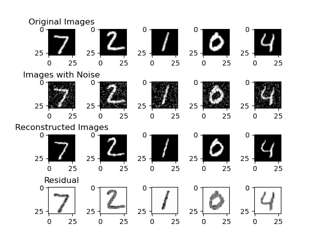


From the result picture, we can observe that the residual is nearly zero in the region where should be black, and there are only tiny difference in the white region. there is no obvious difference between Original Images and Reconstructed Images.

### II. B2  </>

In order to calculate the similarity between images in MNIST, I choose Siamese network to achieve the goal. Because this is the first time I have been exposed to this kind of network, I would like to give my brief introduction of this model to let you know whether I have understood the function and definition of Siamese network.

#### 1. Siamese Model Introduction

> A siamese neural network (SNN) is a class of neural network architectures that contain two or more identical sub-networks. "Identical" here means they have the same configuration with the same parameters and weights. Parameter updating is mirrored across both sub-networks and it's used to find similarities between inputs by comparing feature vectors.

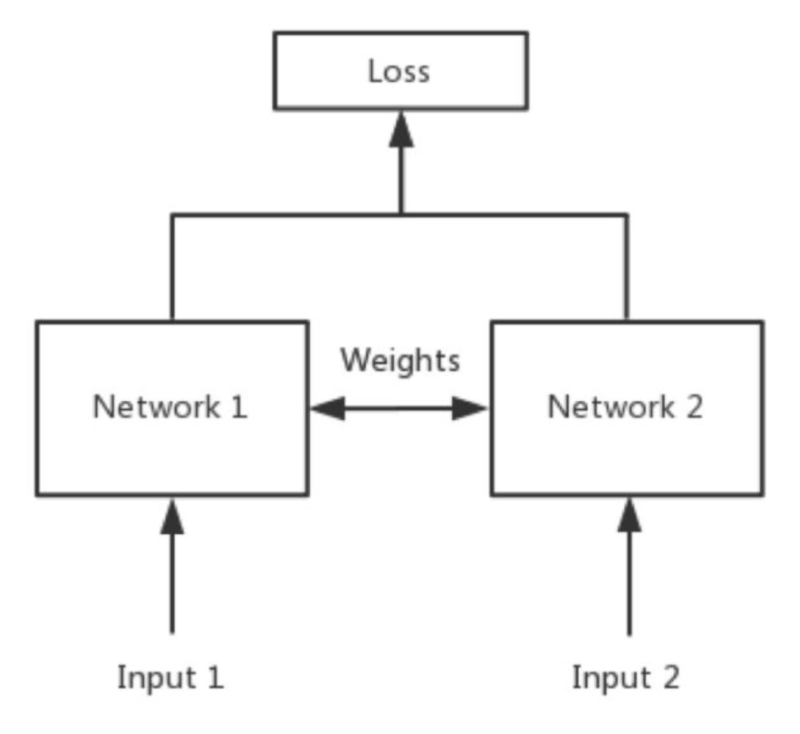

<center>
   [B2]-1 Model arcitecture</center>
</center>

cite from [here](https://builtin.com/machine-learning/siamese-network)

In simple terms, the purpose of Siamese model measures the degree of similarity between two inputs. The Siamese network has two inputs (Input1 and Input2),feeds the two inputs into two neural networks (Network1 and Network2), which map the inputs to a new space respectively, forming a representation of the inputs in the new space. The similarity of the two inputs is evaluated by the calculation of loss.

To train Siamese model, We need a new loss function that is different to traditional loss function applied in deep learning, i.e. contrastive loss.

The fundamental idea behind contrastive loss is to encourage similar samples to be closer in the learned feature space while pushing dissimilar samples farther apart. Let's take a look at the formula:

$$
L(x_i,x_j,y)=\frac12\cdot (1-y) \cdot D(x_i,x_j)^2+\frac12\cdot y\cdot\max(margin-D(x_i,x_j),0)^2
$$

* $L$ is the contrastive loss.
* **$x_i$** and $x_j$ are the output vectors of the two samples in a pair.
* $y$ is the binary label (0 for positive pairs, 1 for negative pairs).
* $D(x_i,x_j)$ is a distance metric (e.g., Euclidean distance or cosine similarity).
* $margin$ is a hyper-parameter that defines the minimum desired distance between positive and negative pairs.

#### Work Process

From what I have outlined my understanding of Siamese network above, we can think of it as a normal neural network, but with two same model in it. Therefore, we need to copy the model once, change the parameter used for forward, define dataset that fit in out requirements and the new loss function by the way.

Finally, when we are trying to evaluate our model, we can calculate the similarity in both positive pairs and negative pairs to see whether it could distinguish them.

#### Result Analysis

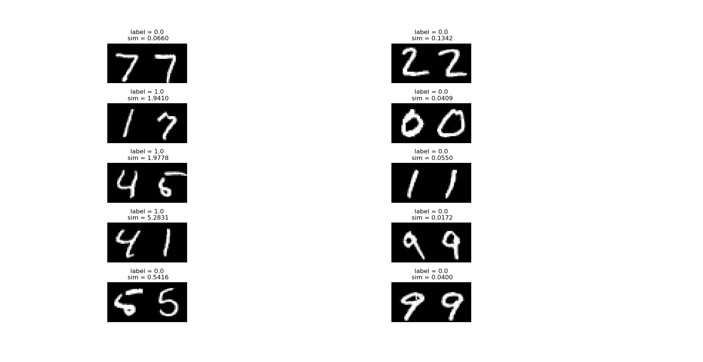

<center>
   [B2]-2 Similarity between positve and negative pairs</center>
</center>

From the graphs shown, the model can distinguish between positive and negative pairs very well, if the two images are the same then the sim will be lower than 1 and vice versa.

### III. B3  </>

In Task B3, I implement a CNN model to classify digits in the MNIST dataset. The model is trained on clean MNIST data and subsequently use a modified dataset where Gaussian noise is added to the images(mentioned in Task B1).

#### 1. Work Process

The provided code follows a standard PyTorch training template, a routine familiar to many AI rookies. I just repeat it twice, and the difference is with or without the noise.

#### 2. Result Analysis

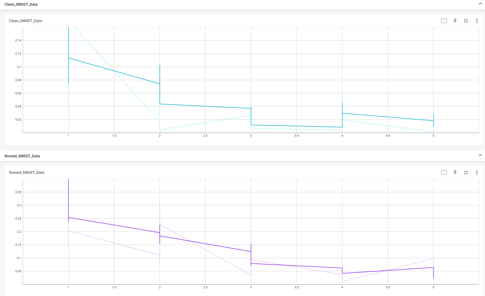

<center>
   [B3]-1 Loss in two tasks</center>
</center>

It might not be very essential to compare loss between these two datasets, however, we can still take a glimpse to check whether there are something valuable.

From the chart, we can recognize that both two line graphs have a decreased trend. Furthermore, the minimum loss in clean MNIST data is slightly lower than the loss in noised MNIST data.

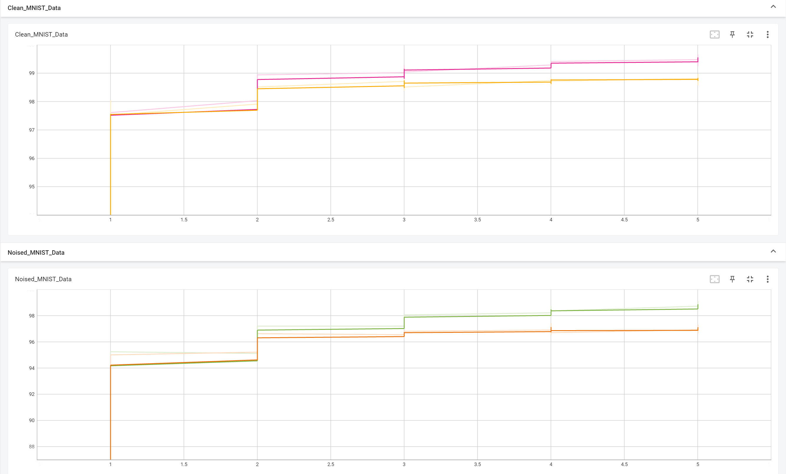

<center>
   [B3]-2 Train / test accuracy in two tasks</center>
</center>

From the accuracies in the figure above, the network shows high performance on both datasets with no overfitting, while the accuracy on the noisy dataset is slightly lower than on the clear MNIST dataset.

### IV. B4

In this section, I select Bellman Optimality Equation as my topic of an artificial intelligent system to discuss in Markov decision process:

- Does the optimal policy exist?
- Is the optimal policy unique?
- Is the optimal policy deterministic or stochastic?
- How to obtain the optimal policy?

The reason I chose this theory to analyze is that this was the first place I struggled with deep learning and reinforcement learning, I spent several nights trying to understand the proofs of the theory here when I first studied it my junior year of college, it was a painful process, but I was very delighted when I understood it and implemented it in code.

#### 1. Discussion

First give the definition of which is better or worse between two policy:

> If:   $V^{\pi_1}(s)\ge V^{\pi_2}(s) \quad \forall s \in S$
>
> i.e., all state values under the $\pi_1$ policy are greater than all state values under the $\pi_2$ policy, then it means that $\pi_1$ is better than $\pi_2$.

Assuming that the optimal strategy is $\pi^*$, one would have

$$
V^{\pi^*}(s) \ge V^\pi(s) \quad \forall s \in S
$$

where $\pi$ is an arbitrary strategy.

So we can say

$$
\pi^*=\arg \max_{\pi}V^\pi(s)
$$

Also the following equation holds:

$$
V^{\pi^*}(s)=\max_\pi V^\pi(s)=\max_\pi \sum_a \pi(a|s)Q(s,a) \quad \forall s \in S
$$

Of course you can also bring in the equation for the relationship between $Q$ and $V$, at which point the above equation reads:

$$
V^{\pi^*}(s)=\max_\pi V^\pi(s)=\max_\pi \sum_a \pi(a|s) \left[\sum_{r} P_r(r \mid s, a) r+\gamma \sum_{s^{\prime}} P_s\left(s^{\prime} \mid s, a\right) V^{\pi}\left(s^{\prime}\right)\right]
$$

What is unknown in this equation? What is known?

- $P_r,P_s$ is known, it is the parameter that describes the whole system: $P_r$ indicates at particular state $s$, agent does particular action $a$, what is the possibility to get reward $r$; and $P_s$ shows that at particular state $s$, agent does particular action $a$, what is the possibility to transition to the next state $s'$
- And $\pi(a|s)$ and $V^\pi(s)$ are unknown (though in the actual code, we initialize $\pi$ and $V(s)$ and find the optimal solution later by iteration)

And here is our first challenge: How are we going to solve for both unknown quantities in one equation?

> Suppose there are two variables $x,a \in R$, and the two variables satisfy the following equation.

$$
x=\max_a(2x-1-a^2)
$$

Let's focus on the right-hand side of the equation: if we want to maximize the value of

$$
\max_a(2x-1-a^2)
$$

we must make $a=0$, and we can get the right-hand side to be $2x-1$. After that, we calculate $x=2x-1$ and get $x=1$. That's how we tackle with the problem of solving for two unknown quantities in a single equation.

Inspired by this example, we know that we first need to determine the $\pi$ and then solve the entire equation.

In the above we used the relation between $V$ and $V'$, in the following we will be solving using the relation equation between $V$ and $Q$.

Now our task focuses on how to find the policy $\pi^*$ that maximizes the following equation:

$$
V^{\pi^*}(s)=\max_\pi \sum_a \pi(a|s)Q(s,a) \quad \forall s \in S.
$$

Assume that $q_{1}, q_{2}, q_{3}\in \mathbb{R}$ is known. Find a set of $c_{1}^{*}, c_{2}^{*}, c_{3}^{*}$ such that

$$
\max _{c_{1}, c_{2}, c_{3}} c_{1} q_{1}+c_{2} q_{2}+c_{3} q_{3}
$$

where $c_{1}+c_{2}+c_{3}=1$ and $c_{1}, c_{2}, c_{3} \geq 0$.

There must be a maximum in $q_{1}, q_{2}, q_{3}$, where it may be useful to set the maximum at $q_{3}$: that is,

$$
q_3\geq q_{1}, q_{2}
$$

Then in order to maximize the whole equation, it is sufficient to let $c^*_3=1,c_{1}^{*}=0, c_{2}^{*}=0$
Or prove it mathematically and rigorously:

$$
1\times q_{3}=\left(c_{1}+c_{2}+c_{3}\right) q_{3}=c_{1} q_{3}+c_{2} q_{3}+c_{3} q_{3} \geq c_{1} q_{1}+c_{2} q_{2}+c_{3} q_{3}
$$

With the above derivation we know that we just need to make the optimal state value $V^{\pi^*}(s)$ equal to the maximum of the action state values:

$$
V^{\pi^*}(s)=\max_\pi \sum_a \pi(a|s)Q(s,a)=\max_{a\in A}Q(s,a)
$$

And at this point the optimal strategy $\pi^*$ should also be adjusted to:

$$
\pi(a \mid s)=\left\{\begin{array}{ll}
1 & a=a^{*} \\\\\\
0 & a \neq a^{*}
\end{array}\right.
\quad where \quad a^{*}=\arg \max _{a} Q(s, a).
$$

##### Contraction mapping theorem

Before we go on, we need to give a theory that will make it easier to prove them later.

###### Fixed Point

For a point $x \in X$, if there exists

$$
f(x)=x
$$

then the point $x$ is said to be a fixed point, i.e., $x$ maps itself back to itself by the mapping relation $f$.

###### Contraction Mapping

If the mapping $f$ satisfies:

$$
\|f(x_{1})-f(x_{2})\| \leq \gamma|x_{1}-x_{2}| \quad \gamma \in (0,1)
$$

Then call $f$ the 为 contraction mapping, as seen in the following example:

Set $f(x)=0.5x$, find its fixed point and prove that $f$ has the property of $\text{contraction mapping}$.

- The fixed point is easy to find $f(0)=0$ , so the fixed point is $0$.
- By definition we compute $\|f(x_{1})-f(x_{2})\|=0.5||x_1-x_2|| \le \gamma ||x_1-x_2|| \quad \forall \gamma \in [0.5,1)$. Therefore $f$ satisfies Contraction Mapping.

#### 2. Contraction Mapping Theorem

This is a very important theorem that plays a role in many fields, and I will only explain the content of the theorem here.

> For equations of the form $x=f(x)$, if $f$ satisfies the properties of Contraction Mapping, the following three properties follow:
>
> 1. existence: there exists an fixed point $x^*$ satisfying $x^*=f(x^*)$
> 2. uniqueness: there exists and exists only one fixed point $x^*$
> 3. How to solve: construct a series $\{x_k\}$ where $x_{k+1}=f(x_k)$ and $x_k \rightarrow x^*$ when $k \rightarrow \infty$. And the rate of convergence is exponential.

##### Apply Contraction Mapping Theorem to solve the problem

Define $f(V):=\max_\pi(R_\pi+\gamma P_\pi V)$.
At this point the original equation can be written as $V=f(V)$.
This way we only need to prove that $f$ has the Contraction Mapping property to be solved by iteration.
The conclusion is still only given here that $f$ has the Contraction Mapping property, i.e.:

$$
\|f(v_1)-f(v_2)\| \le \gamma \|v_1 - v_2\| \quad \gamma \text{is the loss factor}
$$

Since $f$ has the Contraction Mapping property, it follows that

- There exists and exists only one $V^*$ that is the fixed point of $f$ (and it is the optimal value).
- and that $v^*$ can be derived from the following iterative equation:
- 

$$
\begin{aligned}
v_{k+1}&=f(v_{k})=\max _{\pi}(r_{\pi}+\gamma P_{\pi} v_{k})\\
& =\max_{\pi} \sum_{a} \pi(a \mid s)(\sum_{r} p(r \mid s, a) r+\gamma \sum_{s^{\prime}} p(s^{\prime} \mid s, a) v_{k}(s^{\prime}))
\\
& = \max_{\pi} \sum_a \pi(a \mid s)q_k(s,a)
\\
& =\max _{a} q_{k}(s, a)
\end{aligned}
$$

The rate of convergence of $\{v_k\}$ is exponential, so that for any initial $v_0$ the optimal $V$ is obtained in a very short step.

So we can develop an algorithm to solve the problem:

> - For each state $s$ , the value of the state in the $k$ th round is $v_{k}(s)$.
> - For each action $a \in \mathcal{A}(s)$ ,
>   compute
>
> $$
>> q_{k}(s, a)=\sum_{r} p(r \mid s, a) r+\gamma \sum_{s^{\prime}} p\left(s^{\prime} \mid s, a\right) v_{k}\left( s^{\prime}\right)$$ 
> - According to the greedy algorithm each state $s$ corresponds to a strategy $\pi_{k+1}(a|s)$ as
> $$

$$
\pi_{k+1}(a \mid s)=\left\{\begin{array}{ll}
1 & a=a_{k}^{*}(s) \\\\
0 & a \neq a_{k}^{*}(s)
\end{array}\right.
\quad a_{k}^{*}(s)=\arg \max _{a} q_{k}(s, a)
$$

Finally update $v_{k+1}(s) = \max _{a} q_{k}(s, a)$.

#### 3. Summary

At this point we have also answered the opening questions:

1. Does an optimal policy exist?

> The Contraction Mapping Theorem tells us that the optimal policy exists.

2. Is the optimal policy unique?

> The Contraction Mapping Theorem tells us that the optimal value is unique.

1. Is the optimal policy deterministic or stochastic?

> The optimal policy is deterministic because of greedy algorithm.

1. How to obtain (solve) the optimal policy?

> Since $f$ satisfies the Contraction Mapping Theorem, the optimal strategy and optimal value can be solved by iteration.

### V. B5

#### Chaos Theory

The central idea of chaos theory is that the extreme sensitivity of dynamic systems to initial conditions leads them to exhibit seemingly unpredictable behavior. This sensitivity becomes particularly significant in the context of artificial intelligence, where chaos theory emphasizes the high sensitivity of AI systems to small changes in inputs, which may trigger the system to produce very different outputs. Even minor adjustments to the training data or model parameters can lead to significant changes in predictions.

For example, consider a neural network applied to image recognition. In this system, the initial weights and biases, along with the data used for training, are considered the initial conditions of the system. The chaos theory perspective emphasizes that even small disturbances to these input conditions may cause the model to converge to a completely different solution during the training process. For instance, for the same set of image data, small adjustments to the weights or adjustments to the learning rate may cause the network to be more inclined to recognize different features or objects, resulting in very different classification results.

Therefore, when designing and training AI models, a careful approach must be taken to ensure that the system produces consistent and reliable outputs across different input conditions.

#### Game Theory

Game theory focuses on the interactions between decision makers, looking at how rational decision makers pursue individual goals while considering the strategies of other decision makers.

In the case of self-driving vehicles, for example, each vehicle is a rational decision maker aiming to maximize its individual goals, such as minimizing travel time or energy consumption. Game theory provides us with the framework to analyze the strategic interactions between vehicles by taking into account their competitive relationship over a limited resource (the road). In this game, each vehicle's decision will directly affect the overall traffic flow and the achievement of each vehicle's individual goal. Game theory provides us with a theoretical basis for understanding how vehicles act in concert to optimize overall traffic efficiency.

In chess, for example, each move on the board represents a decision. In chess, each player is a rational decision maker aiming to maximize his or her chances of winning. Game theory provides the theoretical basis for how the two players strategize and predict their opponents' possible moves.

During the game, the choice of each move is influenced by the possible moves of the opponent. Players need to balance offense and defense, taking into account the possible reactions of their opponents.

#### Combination of Chaos Theory and Game Theory:

By combining game theory with chaos theory, we are able to understand more comprehensively the dynamic behavior of AI systems in the process of playing chess. Chaos theory emphasizes the sensitivity of the system to initial conditions, and in chess, small differences in the initial position may lead to very different decision paths. By delving into the intersection of game theory and chaos theory, we can better understand how systems develop optimal strategies in different positions.

## Advanced tasks

### I. A7 </>

In Task A7, I selected Echo State Network(ESN), a classical type of reservior network to predict the data in Mackey-Glass(n=17).

Because I am a freshman of this region, in the following section, I would like to share my understanding about the ESN that I have got in recent days firstly. After that I will introduce my implementation to let you know how I made it successful to predict and my analysis for the evaluation.

#### Dataset

I chose "[Mackey-Glass chaotic time series dataset](http://www.scholarpedia.org/article/Mackey-Glass_equation)" to feed my ESN. The data are generated by this nonlinear time delay differential equation:

$$
\frac{dx}{dt}=\beta \frac{x(t-\tau)}{1+x(t-\tau)^n}-\gamma x(t)
$$

Here:

* $x(t)$represents the system state variable that changes with time.
* $t$ denotes time.
* $\beta$ and $\gamma$ are parameters controlling the system's dynamics.
* $\tau$ signifies time delay.
* $n$ stands for a nonlinear parameter.

#### Echo State Network

ESN is a simple but efficient model which can learn the pattern in the time series data. There are three components in ESN.

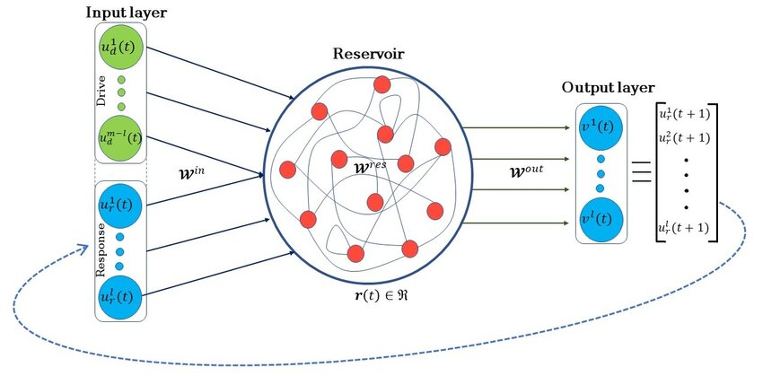

<center>
   [A7]-1 ESN architecture</center>
</center>

* The weights between the input and the reservoir, denoted as $W_{in}$, as well as the weights within the reservoir $W_r$, are randomly assigned and remain static throughout the network's operation.
* Conversely, the weights associated with the output neurons ($W_{out}$) are trainable (trainable means we could use ridge regression to calculate the weight $W_{out}$ through the data). This allows the network to adapt and learn specific temporal patterns.
* The reservoir architecture creates a recurrent non linear embedding of the input which can be then connected to the output. Reservoir is very sparsely connected, typically < 10% connectivity.

#### Implementation

The core formula are as follows:

$$
\begin{aligned} x'(n)&=f(W_{in}[1;u(n)]+W_rx(n-1)),&(1)\\x(n)&=(1-\alpha)x(n-1)+\alpha x'(n),&(2)\\ y(n)&=W_{out}[1;u(n);x(n)],&(3)\end{aligned}
$$

where $x(n) \in R^{N_x}$ is the vector of activated reservior neurons, and $x' \in R^{N_x}$ is the state at the next time. $W_{in}$ represents the connection weight matrix between the input $u(n)$ and the reservior; $W_r$ represents the cyclic connection weight matrix between the neuron nodes inside the reservior, and $W_{out}$ denotes the weight matrix between the reservior and the output $y(n)$. Both $ W_{in}$ and $W_r$ are randomly generated and are constant during training. The leaking rate $\alpha$ determines how much of the state of the reservior is discarded, which controls the rate at which the state is updated.

To train $W_{out}$, we use ridge regression to calculate:

$$
W_{out}=\mathbf{Y}_{target}X^T(XX^T+\beta I)^{-1}
$$

where $\beta$ is the regularization factor, $I$ is a unit matrix, and $X$ is a matrix of all states of the reservior nodes.

The code implementation is shown below and you can find its source code in the A7 folder:

```python
# run the reservoir with the data and collect X
x = np.zeros((hidden_size, 1))
for t in range(train_size):
    u = data[t]
    x = (1-leaking_rate)*x + leaking_rate * \
        np.tanh(np.matmul(W_in, np.vstack((1, u))) + np.matmul(W_h, x))
    X[:, t] = np.vstack((1, u, x))[:, 0]

# ridge regression
lambda_reg = 1e-8
W_out = linalg.solve(np.matmul(X, X.T) + lambda_reg*np.eye(1+input_size+hidden_size),
                     np.matmul(X, Yt.T)).T
```

#### Analysis

I changed the hidden size which control the number of the node in the reservior to analyze the influence of it. And the result are shown in figure below.

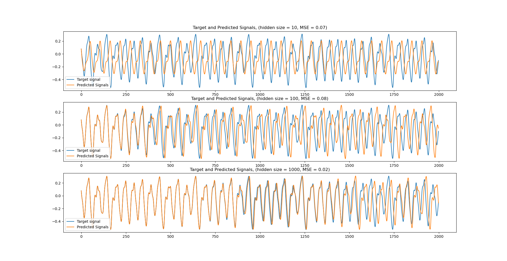

<center>
   [A7]-2 Prediction output</center>
</center>

As the hidden size increases, the predicted signal gets closer and closer to the target signal, but all of them show large errors after the horizontal coordinate is larger than 1500.
From the MSE error, the MSE shows a tendency of increasing and then decreasing.

However, when comparing the hidden size equal to 100 and equal to 10, the former performs better in predicting the signal value, which means that he learns the data pattern more correctly.

### II. A9 </>

Intrinsic curiosity is a type of reinforcement learning in which the reward signal is generated internally by the agent rather than being provided by the external environment. This allows the agent to explore and learn complex and dynamic environments without the need for external rewards or punishment.

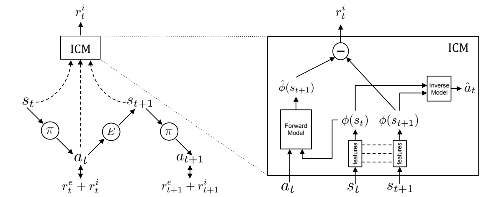

<center>
   [A9]-1  Intrinsic curiosity module</center>
</center>

In contrast to the conventional algorithm's extrinsic reward  $r^e_t$, the curiosity mechanism mainly embodies the addition of an intrinsic reward $r^i_t$ , thus transforming a sparse reward into a dense reward $r^e_t+r^i_t$. The curiosity mechanism is mainly in adding an intrinsic reward, thus transforming a sparse reward into a dense reward.

As shown in the figure above, the ICM(Intrinsic Curiosity Module) that generates curiosity reward mainly consists of three modules: forward model, inverse model, and feature extraction:

- The feature extraction module combines the state $S_t$ and $S_{t+1}$ into 2 feature vectors  $\phi(S_t)$ and $\phi(S_{t+1})$. This is because the forward model has difficulty in accurately predicting , such as moving tree leaves in an image which was mentioned in the paper.
- Both the forward and inverse models are trained using supervised learning, with the goal of minimizing the prediction error between the predicted and actual outcomes. The prediction error is used to generate a curiosity reward, which is then used to update the agent's internal models and improve its understanding of the environment.

The above mentioned is my understanding of ICM, I must admit that my understanding is still too superficial, there are a lot of details of the problem and the reason I have not yet understood, in the next code I focus more on the implementation of them in the project.

#### Task1 - CartPole

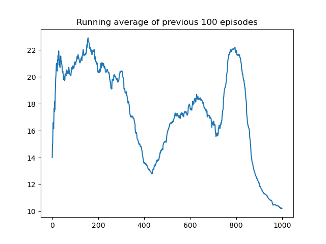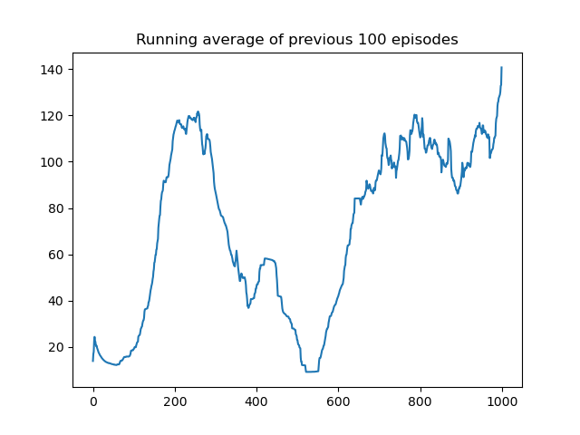

    [A9]-2  scores plot by A2C Algorithm in CartPole Problem					[A9]-3  scores plot by A2C Algorithm with ICM in CartPole Problem

Cartpole is known also as an Inverted Pendulum, which is a pendulum with a center of gravity above its pivot point. It's unstable, but can be controlled by moving the pivot point under the center of mass. The goal is to keep the cartpole balanced by applying appropriate forces to a pivot point. It is like the MNIST dataset in deep learning - the first challenge every rookie encounters.

In the CartPole task, the agent with ICM showed good performance after 800 epochs, and was able to maintain a score above 100, with a continuing upward trend. On the other hand, the agent without ICM has a mediocre performance, with the highest average score being only about 22, which is not reaching the threshold for successful training.

#### Task2 - AcroBot

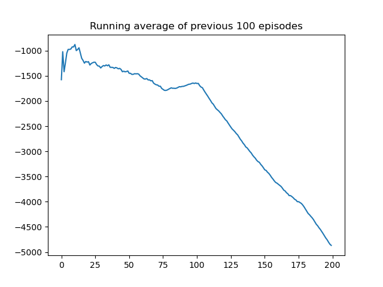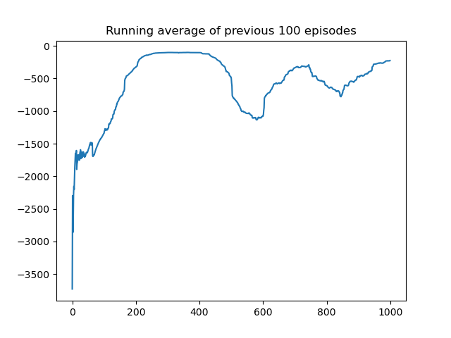

    [A9]-2  scores plot by A2C Algorithm in AcroBot Problem					[A9]-3  scores plot by A2C Algorithm with ICM in AcroBot Problem

The Acrobot environment is based on Sutton's work in "Generalization in Reinforcement Learning: Successful Examples Using Sparse Coarse Coding". The system consists of two links connected linearly to form a chain, with one end of the chain fixed. The joint between the two links is actuated. The goal is to apply torques on the actuated joint to swing the free end of the linear chain above a given height while starting from the initial state of hanging downwards.

In AcroBot task, the agent with ICM also showed good performance just after 200 epochs, which is higher than the score threshold: -100. Despite fluctuations during subsequent training sessions, it eventually almost stabilized around -100. However, for the agent without ICM, it did not learn anything from the training process, getting the lowest score of -5000 for the last 100 epochs; and the training process was extremely slow, taking 33 minutes and 31 seconds for just 200 epochs, whereas on the contrary, the agent with ICM took only 33 minutes and 7 seconds to train 1000 epochs.
